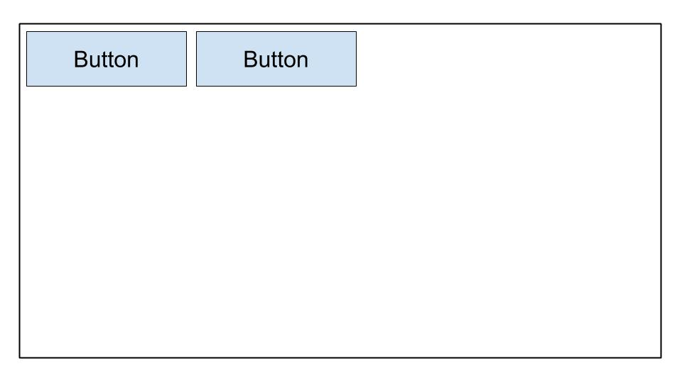
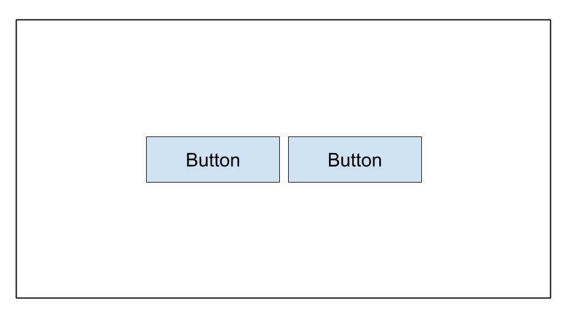
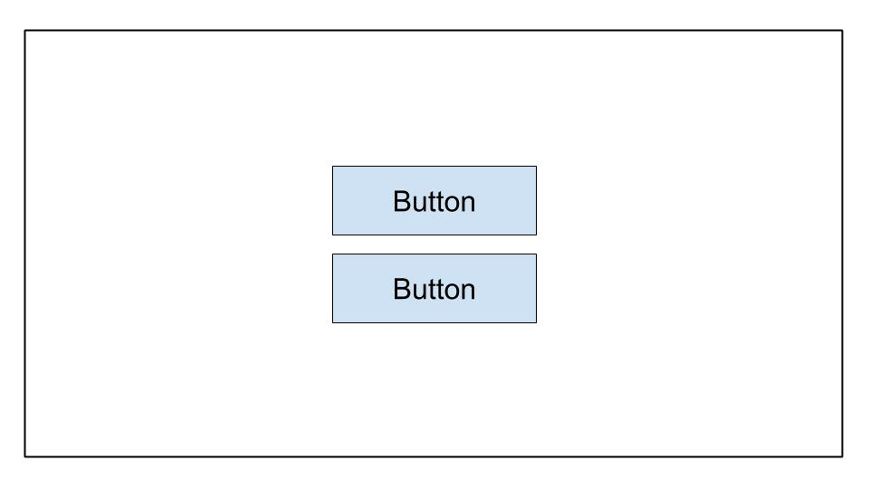
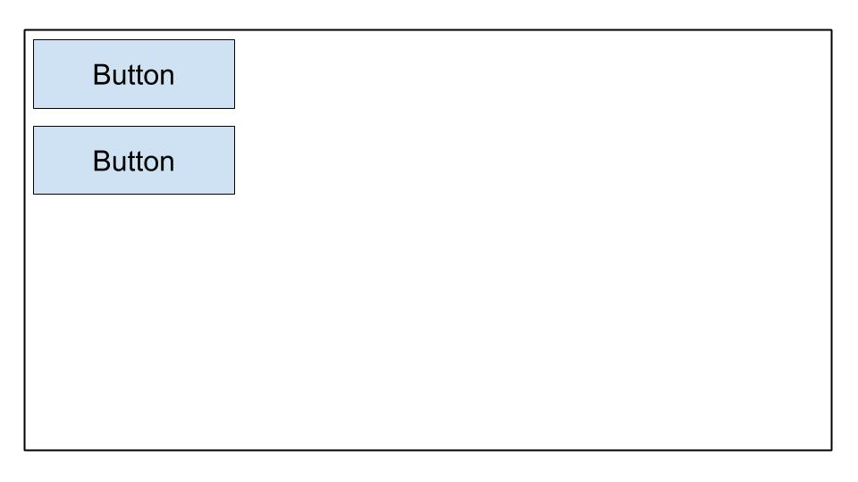
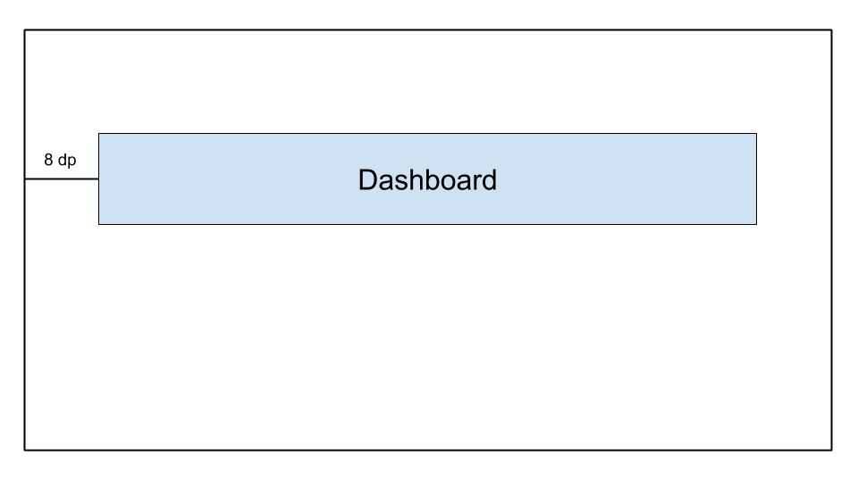
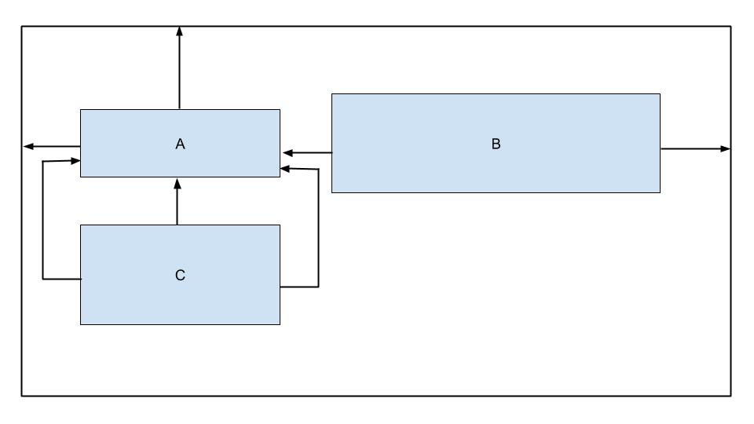
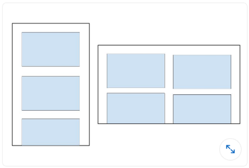

## ANDROID QUIZ

#### Q1. To add features, components, and permissions to your Android app, which file needs to be edited?

- [x] AndroidManifest.xml
- [ ] Components.xml
- [ ] AppManifest.xml
- [ ] ComponentManifest.xml

> [!NOTE]
> The correct file to edit when adding features, components, and permissions to your Android app is the AndroidManifest.xml. This file contains essential information about your app and its components.

#### Q2. Which XML attribute should be used to make an Image View accessible?

- [ ] android:talkBack
- [ ] android:labelFor
- [ ] android:hint
- [x] android:contentDescription

> [!NOTE]
> The `android:contentDescription` attribute should be used to provide a textual description of the image for accessibility purposes, aiding users who rely on screen readers.

#### Q3. You launch your app, and when you navigate to a new screen it crashes. Which action will NOT help you diagnose the issue?

- [ ] Set breakpoints and then step through the code line by line
- [ ] Use the profiler tools in Android Studio to detect anomalies in CPU and network usage.
- [x] Add a Thread.sleep() call before you start the new activity.
- [ ] Inspect the logs in Logcat.

> [!NOTE]
> Adding a `Thread.sleep()` call before starting a new activity will not help diagnose the issue of a crashing app. It might introduce artificial delays but won't address the root cause of the crash.

#### Q4. Why might push notifications stop working?

- [x] all of these answers
- [ ] The device token is not being sent to push the provider correctly.
- [ ] Google Play Services is not installed on the device/emulator.
- [ ] Battery optimization is turned on on the device.

> [!NOTE]
> Push notifications might stop working due to various reasons listed in the options, including issues with the device token, Google Play Services, and battery optimization.

#### Q5. What is the correct set of component classes needed to implement a RecyclerView of items that displays a list of widgets vertically?

- [ ] A

```java
    RecycleView
    RecyclerView.Adapter<T extends BaseAdapter>
    RecyclerView.ViewHolder<T extends BaseViewHolder>
    LinearLayoutManager
```

- [ ] B

```java
    RecycleView
    RecyclerView.Adapter
    RecyclerView.ViewHolder<T extends BaseViewHolder>
    LinearLayoutManager
```

- [ ] C

```java
    RecycleView
    RecyclerView.Adapter
    RecyclerView.ViewHolder
    LinearLayoutManager
```

- [x] D

```java
    RecycleView
    RecyclerView.Adapter<VH extends ViewHolder>
    RecyclerView.ViewHolder
    LinearLayoutManager
```

> [!NOTE]
> The correct set of component classes needed for a RecyclerView includes `RecyclerView`, `RecyclerView.Adapter<VH extends ViewHolder>`, `RecyclerView.ViewHolder`, and `LinearLayoutManager`.

#### Q6. The Android system kills the process when it needs to free up memory. The likelihood of the system killing a given process depends on the state of the process and the activity at the time. With a combination of process and activity state is most likely to be killed?

- [x] Process: In the background; Activity: Is stopped
- [ ] Process: In the background; Activity: Is paused
- [ ] Process: In the foreground; Activity: Is started
- [ ] Process: In the foreground; Activity: Is paused

> [!NOTE]
> When the process is in the background and the activity is stopped, it's more likely for the Android system to kill the process to free up memory.

#### Q7. You have created a NextActivity class that relies on a string containing some data that passes inside the intent. Which code snippet allows you to launch your activity?

- [ ] A

```java
    Intent(this, NextActivity::class.java).also { intent ->
        startActivity(intent)
    }
```

- [ ] B

```java
    Intent(this, NextActivity::class.java).apply {
        put(EXTRA_NEXT, "some data")
    }.also { intent ->
        activityStart(intent)
    }
```

- [x] C

```java
    Intent(this, NextActivity::class.java).apply {
        putExtra(EXTRA_NEXT, "some data")
    }.also { intent ->
        startActivity(intent)
    }
```

- [ ] D

```java
    Intent(this, NextActivity::class.java).apply {
        put(EXTRA_NEXT, "some data")
    }.also { intent ->
        activityStart(intent)
    }
```

> [!NOTE]
> The correct way to launch an activity with intent containing data is to use `putExtra()` to add data to the intent before starting the activity using `startActivity(intent)`.

#### Q8. You want to include about and setting modules in your project. Which files accurately reflect their inclusion?

- [ ] `in build.gradle:include ':app',':about' ':settings'`
- [x] `in settings.gradle:include ':app',':about' ':settings'`
- [ ] `in settings.gradle:include ':about',':settings'`
- [ ] `in gradle.properties:include ':app',':about' ':settings'`

> [!NOTE]
> To include modules in your project, you need to modify the `settings.gradle` file to list the modules to be included.

#### Q9. What is the benefit of using @VisibleForTesting annotation?

- [x] to denote that a class, method, or field has its visibility relaxed to make code testable
- [ ] to denote that a class, method, or field is visible only in the test code
- [ ] to denote that a class, method, or field has its visibility increased to make code less testable
- [ ] to throw a run-time error if a class, method, or field with this annotation is accessed improperly

> [!NOTE]
> The `@VisibleForTesting` annotation is used to denote that a class, method, or field has its visibility relaxed to make the code testable. It's typically used in situations where you need to access normally private or package-private members for testing purposes.

#### Q10. How would you specify in your build.gradle file that your app required at least API level 21 to run, but it can be tested on API level 28?

- [ ] A

```
      defaultConfig {
        ...
        minApiVersion 21
        targetApiVersion 28
      }
```

- [ ] B

```
      defaultConfig {
        ...
        targetSdkVersion 21
        testSdkVersion 28
      }
```

- [ ] C

```
      defaultConfig {
        ...
        minSdkVersion 21
        testApiVersion 28
      }
```

- [x] D

```
      defaultConfig {
        ...
      minSdkVersion 21
        targetSdkVersion 28
      }
```

> [!NOTE]
> To specify in the build.gradle file that your app requires at least API level 21 to run but can be tested on API level 28, you need to set `minSdkVersion` to 21 and `targetSdkVersion` to 28 in the `defaultConfig` block.

#### Q11. When will an activity's onActivityResult() be called?

- [ ] when calling finish() in the parent activity
- [ ] when placing an app into the background by switching to another app
- [ ] When onStop() is called in the target activity
- [x] when calling finish() in the target activity

> [!NOTE]
> The `onActivityResult()` method is called when an activity launched by `startActivityForResult()` finishes, and the `finish()` method is called in the target activity.

#### Q12. You need to remove an Event based on its ID from your API. Which code snippet defines that request in Retrofit?

- [ ] @DELETE("events)
      fun deleteEvent(@Path("id") id: Long): Call<Unit>
- [x] @DELETE("events/{id}")
      fun deleteEvent(@Path("id") id: Long): Call<Unit>
- [ ] @REMOVE("events/{id}")
      fun deleteEvent(@Path("id") id: Long): Call<Unit>
- [x] @DELETE("events/{id}")
      fun deleteEvent(@Path("id") id: Long): Call<Unit>

> [!NOTE]
> The correct Retrofit annotation to define a DELETE request with a dynamic path parameter is `@DELETE("events/{id}")`.

#### Q13. When would you use a product flavor in your build setup?

- [ ] when you need to have the app's strings present in multiple languages
- [ ] when you have to provide different versions of your app based on the physical device size
- [ ] when you want to provide different versions of your app based on the device screen density
- [x] When you want to provide a different version of your app with custom configuration and resources

> [!NOTE]
> Product flavors are used when you want to provide different versions of your app with custom configurations and resources, such as different branding or features.

#### Q14. Given the fragment below, how would you get access to a TextView with an ID of text_home contained in the layout file of a Fragment class?

```java
    private lateinit var textView: TextView
    override fun onCreateView(...): View? {
        val root = inflator.inflator(R>layout.fragment_home, container, false)
        textView = ??
        return root
    }
```

- [ ] root.getById(R.id.text_home)
- [ ] findViewByID(R.id.text_home)
- [x] root.findViewById(R.id.text_home)
- [ ] root.find(R.id.text_home)

> [!NOTE]
> To access a TextView with ID text_home in a Fragment, you should use `root.findViewById(R.id.text_home)` after inflating the layout.

#### Q15. Why do you use the AndroidJUnitRunner when running UI tests?

Notice: AndroidJUnitRunner lets us run JUnit3/4-style tests on Android Devices

- [x] The test runner facilitates loading your test package and the app under test onto a device or emulator, runs the test, and reports the results.
- [ ] The test runner creates screenshots of each screen that is displayed while tests are executed.
- [ ] The test runner facilitates the parallelization of test classes by providing for each test class.
- [ ] The test runner facilitates interacting with visible elements on a device, regardless of the activity or fragment that has focus.

> [!NOTE]
> AndroidJUnitRunner is used to facilitate loading the test package and the app under test onto a device or emulator, running the test, and reporting the results.

#### Q16. What allows you to properly restore a user's state when an activity is restarted?

- [ ] the onSaveInstance() method
- [x] all of these answers
- [ ] persistent storage
- [ ] ViewModel objects

> [!NOTE]
> All of the provided options contribute to properly restoring a user's state when an activity is restarted.

#### Q17. If the main thread is blocked for too long, the system displays the \_ dialog.

- [ ] Thread Not Responding
- [ ] Application Paused
- [x] Application Not Responding
- [ ] Application Blocked

> [!NOTE]
> If the main thread is blocked for too long, the system displays the "Application Not Responding" dialog.

#### Q18. How would you retrieve the value of a user's email from SharedPreferences while ensuring that the returned value is not null?

- [ ] getPreferances(this).getString(Email,"")
- [ ] getDefaultSharedPrefarances(this).getString(EMAIL,null)
- [x] getDefaultSharedPreferances(this).getString(EMAIL,"")
- [ ] getPreferances(this).getString(EMAIL,null)

> [!NOTE]
> In the method `getDefaultSharedPreferences(this).getString()`, the second parameter is passed so that it can be returned in case the key doesn't exist. So we need to pass an empty string to be returned in case the key doesn't exist.

#### Q19. Why is it problematic to define sizes using pixels on Android?

- [ ] Although screen pixel density varies, this does not impact the use of pixels to define sizes.
- [ ] Large devices always have more pixels, so your UI elements will be affected if you define them with pixels.
- [x] The same number of pixels may correspond to different physical sizes, affecting the appearance of your UI elements.
- [ ] Different devices have different understandings of what a pixel is, affecting the appearance of your UI elements

> [!NOTE]
> It's problematic to define sizes using pixels on Android because the same number of pixels may correspond to different physical sizes, affecting the appearance of UI elements on different devices.

#### Q20. You need to get a list of devices that are attached to your computer with USB debugging enabled. Which command would execute using the Android Debug Bridge?

- [ ] list devices
- [x] adb devices
- [ ] list avd
- [ ] dir devices

> [!NOTE]
> To get a list of devices attached to your computer with USB debugging enabled, you would use the command `adb devices`.


#### Q21. Which drawable definition allows you to achieve the shape below?


- [ ] A

```xml
    <shape xmlns:android="http://schemas.android.com/apk/res/android"
        android:shape="oval">
        <stroke
            android:width="4dp"
	    android:color="@android:color/white" />
	<solid android:color="@android:color/black" />
    </shape>
```

- [ ] B

```xml
    <oval xmlns:android="http://schemas.android.com/apk/res/android">
        <stroke android:width="4dp" android:color="@android:color/black"/>
        <solid android:color="@android:color/white"/>
    </oval>
```

- [x] C

```xml
    <shape xmlns:android="http://schemas.android.com/apk/res/android"
        android:shape="oval">
        <stroke
            android:width="4dp"
            android:color="@android:color/black" />
        <solid android:color="@android:color/white" />
    </shape>
```

- [ ] D

```xml
    <shape xmlns:android="http://schemas.android.com/apk/res/android"
        android:shape="oval">
        <stroke
            android:width="4dp"
            android:color="@android:color/white" />
        <solid android:color="@android:color/white" />
    </shape>
```

> [!NOTE]
> The correct drawable definition to achieve the shape provided is option C.

#### Q22. To persist a small collection of key-value data, what should you use?

- [ ] external file storage
- [x] SharedPreferences
- [ ] SQLite
- [ ] internal file storage

> [!NOTE]
> To persist a small collection of key-value data, you should use SharedPreferences.

#### Q23. You need to retrieve a list of photos from an API. Which code snippet defines an HTML GET request in Retrofit?

- [ ] @GET("photo/{id}"}
      fun listPhotos(@Path("id") id:Long?) : Call<Photo>
- [ ] @LIST("photo")
      fun listPhotos() : Call<List<Photo>>
- [ ] @GET("photo")
      fun listPhotos() : Call<Photo>
- [x] @GET("photo")
      fun listPhotos() : Call<List<Photo>>

> [!NOTE]
> The correct code snippet to define an HTML GET request in Retrofit for retrieving a list of photos from an API is the last option.

#### Q24. Given the test class below, which code snippet would be a correct assertion?

- [ ] assertThat(resultAdd).is(2.0)
- [x] assertNotNull(resultAdd)
- [ ] assertThat(resultAdd).isWqualTo(2.0)
- [ ] assertThat(resultAdd)

> [!NOTE]
> The correct assertion for the given test class would be to ensure that the `resultAdd` is not null, hence `assertNotNull(resultAdd)`.

#### Q25. What tag should you use to add a reusable view component to a layout file?

- [ ] `<merge/>`
- [x] `<include/>`
- [ ] `<layout/>`
- [ ] `<add/>`

> [!NOTE]
> To add a reusable view component to a layout file, you should use the `<include/>` tag.

#### Q26. You want to provide a different drawable for devices that are in landscape mode and whose language is set to French. which directory is named correctly?

- [ ] fr-land-drawable
- [x] drawable-fr-land
- [ ] drawable-french-land
- [ ] french-land-drawable

> [!NOTE]
> The correct directory naming for providing a different drawable for devices in landscape mode and whose language is set to French is `drawable-fr-land`.

#### Q27. Why might you need to include the following permission to your app?

`android.permission.ACCESS_NETWORK_STATE`

- [ ] to monitor the location of the devices so that you don't attempt to make network calls when the user is stationary
- [ ] to request the ability to make network calls from your app
- [ ] to monitor the network state of the device so that you can display an in-app banner to the user
- [x] to monitor the network state of the devices so that you don't attempt to make network calls when the network is unavailable

> [!NOTE]
> The permission `android.permission.ACCESS_NETWORK_STATE` is needed to monitor the network state of the devices so that you don't attempt to make network calls when the network is unavailable.

#### Q28. Which image best corresponds to the following `LinearLayout`?

```xml
    <LinearLayout
        android:layout_width="match_parent"
	android:layout_height="match_parent"
	android:orientation="horizontal"
	android:gravity="center">
	<Button
            android:layout_width="wrap_content"
            android:layout_height="wrap_content"
            android:text="Button" />
	<Button
            android:layout_width="wrap_content"
            android:layout_height="wrap_content"
            android:text="Button" />
        </LinearLayout>
```

- [ ] A
      
- [x] B
      
- [ ] C
      
- [ ] D
      

> [!NOTE]
> The image that best corresponds to the given `LinearLayout` is option B.

#### Q29. You want to open the default Dialer app on a device. What is wrong with this code?

```
val dialerIntent = Intent()
val et = findViewById(R.id.some_edit_text)
dialerIntent.action = Intent.ACTION_DIAL
dialerIntent.data = Uri.parse("tel:" + et.getText()?.toString())
startActivity(dialerIntent)
```

- [x] `startActivityWithResult()` should be used instead of `startActivity()` when using `Intent.ACTION_DIAL`.
- [ ] For `Intent.ACTION_DIAL`, the `Intent` option `Intent.FLAG_ACTIVITY_NEW_TASK` must be added when using this `dialerIntent`.
- [ ] The `dialerIntent` will cause an ActivityNotFoundException to be thrown on devices that do not support `Intent.ACTION_DIAL`.
- [ ] The permission `android.permission.CALL_PHONE` must be requested first before `Intent.ACTION_DIAL` can be used.

> [!NOTE]
> When using `Intent.ACTION_DIAL`, `startActivityForResult()` should be used instead of `startActivity()`.

#### Q30. When should you store files in the `/assets` directory?

- [x] when you need access to the original file names and file hierarchy
- [ ] when you need access to the file with its `resource ID`, like `R.assets.filename`
- [ ] when you have XML files that define tween animations
- [ ] when you need to access the file in its raw form using `Resources.openRawResource()`

> [!NOTE]
> Files should be stored in the `/assets` directory when you need access to the original file names and file

 hierarchy.

#### Q31. You want to allow users to take pictures in your app. Which is _not_ an advantage of creating an appropriate `intent`, instead of requesting the camera permission directly?

- [ ] Users can select their favorite photo apps to take pictures.
- [ ] You do not have to make a permission request in your app to take a picture.
- [x] You have full control over the user experience. The app that handles the camera `intent` will respect your design choices.
- [ ] You do not have to design the UI. The app that handles the camera `intent` will provide the UI.

> [!NOTE]
> The option that is not an advantage of creating an appropriate `intent` is that you have full control over the user experience. The app that handles the camera `intent` will not necessarily respect your design choices.

#### Q32. When would you use the `ActivityCompat.shouldShowRequestPermissionRationale()` function?

- [ ] when a user first opens your app and you want to explain the use of a given permission
- [ ] when a user has previously denied the request for a given permission and selects "Tell me more"
- [ ] when a user has previously denied the request for a given permission and you want to explain its use
- [x] when a user has previously denied the request for a given permission and selected "Don't ask again," but you need the permission for your app to function

> [!NOTE]
> `ActivityCompat.shouldShowRequestPermissionRationale()` function is used when a user has previously denied the request for a given permission and selected "Don't ask again," but you need the permission for your app to function.

#### Q33. You would like to enable analytics tracking only in `release` builds. How can you create a new field in the generated `BuildConfig` class to store that value?

- [ ] A

```
buildTypes {
	debug {
		buildConfig 'boolean', 'ENABLE_ANALYTICS', 'false'
	}
	release {
		buildConfig 'boolean', 'ENABLE_ANALYTICS', 'true'
	}
}
```

- [ ] B

```
buildTypes {
	debug {
		buildConfig 'String', 'ENABLE_ANALYTICS', 'false'
	}
	release {
		buildConfig 'String', 'ENABLE_ANALYTICS', 'true'
	}
}
```

- [x] C

```
buildTypes {
	debug {
		buildConfigField 'boolean', 'ENABLE_ANALYTICS', 'false'
	}
	release {
		buildConfigField 'boolean', 'ENABLE_ANALYTICS', 'true'
	}
}
```

- [ ] D

```
buildTypes {
	debug {
		buildConfigField 'boolean', 'ENABLE_ANALYTICS', 'true'
	}
	release {
		buildConfigField 'boolean', 'ENABLE_ANALYTICS', 'false'
	}
}
```

> [!NOTE]
> To create a new field in the generated `BuildConfig` class to store a value, you should use option C.

#### Q34. To optimize your APK size, what image codec should you use?

- [ ] JPG
- [ ] PNG
- [ ] MPEG
- [x] WebP

> [!NOTE]
> To optimize your APK size, you should use the WebP image codec.

#### Q35. You have built code to make a network call and tested that it works in your development environment. However, when you publish it to the Play console, the networking call fails to work. What will _not_ help you troubleshoot this issue?

- [ ] checking whether `ProGuard` -keepclassmembers have been added to the network data transfer objects (DTOs) in question
- [x] using the profiler tools in Android Studio to detect anomalies in CPU, memory, and network usage
- [ ] checking for exceptions in the server logs or server console
- [ ] checking that the network data transfer object has `@SerializedName` applied to its member properties

> [!NOTE]
> Using the profiler tools in Android Studio to detect anomalies in CPU, memory, and network usage will not help troubleshoot the issue of a failed network call after publishing to the Play console.

#### Q36. Which code snippet would achieve the layout displayed below?



- [ ] A

```xml
    <androidx.constraintlayout.widget.ConstraintLayout
	...>

	<TextView
		android:id="@+id/text_dashboard"
		android:layout_width="match_parent"
		android:layout_height="wrap_content"
		android:layout_marginTop="16dp"
		android:padding="8dp"
		android:textAlignment="center"
		android:text="Dashboard"
		app:layout_constraintEnd_toEndOf="parent"
		app:layout_constraintStart_toStartOf="parent"
		app:layout_constraintTop_toTopOf="parent" />

    </androidx.constraintlayout.widget.ConstraintLayout>
```

- [x] B

```xml
    <androidx.constraintlayout.widget.ConstraintLayout
	...>

	<TextView
		android:id="@+id/text_dashboard"
		android:layout_width="match_parent"
		android:layout_height="wrap_content"
		android:layout_marginStart="8dp"
		android:layout_marginEnd="8dp"
		android:textAlignment="center"
		android:text="Dashboard"
		app:layout_constraintEnd_toEndOf="parent"
		app:layout_constraintStart_toStartOf="parent"
		app:layout_constraintTop_toTopOf="parent" />

    </androidx.constraintlayout.widget.ConstraintLayout>
```

- [ ] C

```xml
    <androidx.constraintlayout.widget.ConstraintLayout
	...>

	<TextView
		android:id="@+id/text_dashboard"
		android:layout_width="match_parent"
		android:layout_height="wrap_content"
		android:layout_marginStart="8dp"
		android:layout_marginTop="16dp"
		android:layout_marginEnd="8dp"
		android:padding="8dp"
		android:textAlignment="center"
		android:text="Dashboard"
		app:layout_constraintEnd_toEndOf="parent"
		app:layout_constraintStart_toStartOf="parent"
		app:layout_constraintTop_toTopOf="parent" />

    </androidx.constraintlayout.widget.ConstraintLayout>
```

- [ ] D

```xml
    <androidx.constraintlayout.widget.ConstraintLayout
	...>

	<TextView
		android:id="@+id/text_dashboard"
		android:layout_width="match_parent"
		android:layout_height="wrap_content"
		android:layout_marginStart="8dp"
		android:layout_marginTop="16dp"
		android:layout_marginEnd="8dp"
		android:padding="8dp"
		android:text="Dashboard"
		app:layout_constraintEnd_toEndOf="parent"
		app:layout_constraintStart_toStartOf="parent"
	/>

</androidx.constraintlayout.widget.ConstraintLayout>
```

> [!NOTE]
> The correct code snippet to achieve the layout displayed below is option B.

#### Q37. Which source set is _not_ available to you by default when Android Studio creates a new project?

- [ ] test
- [

 ] androidTest
- [ ] app
- [x] main

> [!NOTE]
> The source set that is not available to you by default when Android Studio creates a new project is option D - `main`.

#### Q38. Which definition will prevent other apps from accessing your `Activity` class via an `intent`?

- [x] A

```xml
	<activity android:name=".ExampleActivity" />
```

- [ ] B

```xml
	<activity android:name=".ExampleActivity">
		<intent-filter>
			<action android:name="android.intent.action.SEND" />
		</intent-filter>
	</activity>
```

- [ ] C

```xml
	<activity android:name=".ExampleActivity">
		<intent-filter>
			<action android:name="android.intent.action.MAIN" />
			<category android:name="android.intent.category.LAUNCHER" />
		</intent-filter>
	</activity>
```

- [ ] D

```xml
	<activity android:name=".ExampleActivity">
		<intent-filter>
			<action android:name="android.intent.action.VIEW" />
		</intent-filter>
	</activity>
```

> [!NOTE]
> Option A, `<activity android:name=".ExampleActivity" />`, will prevent other apps from accessing your `Activity` class via an `intent`.

#### Q39. To preserve on-device memory, how might you determine that the user's device has limited storage capabilities?

- [x] Use the `ActivityManager.isLowRamDevice()` method to find out whether a device defines itself as "low RAM."
- [ ] Use the `Activity.islowRam()` method to find out whether a device defines itself as "low RAM."
- [ ] Use the `ConnectivityManager.hasLowMemory()` method to find out whether a device defines itself as "low RAM."
- [ ] Make an image download request and check the remaining device storage usage.

> [!NOTE]
> To determine that the user's device has limited storage capabilities, you should use the `ActivityManager.isLowRamDevice()` method to find out whether a device defines itself as "low RAM."

#### Q40. What is _not_ a good way to reuse Android code?

- [ ] Use a common Gradle module shared by different Android projects.
- [ ] Prefer to build custom views or fragments over activities.
- [x] Prefer to build activities instead of fragments.
- [ ] Break down UI layouts into common elements and use `<include/>` to include them in other layout XML files.

> [!NOTE]
> A good way to reuse Android code is not to prefer building activities instead of fragments. Activities are generally used to represent a single screen with a user interface, whereas fragments represent a portion of a user interface. Fragments are more suitable for reuse across multiple activities.


#### Q41. Which layout is best for large, complex hierarchies?

- [ ] LinearLayout
- [x] ConstraintLayout
- [ ] FrameLayout
- [ ] RelativeLayout

> [!NOTE]
> For large, complex hierarchies, ConstraintLayout is the best choice as it allows for flexible and efficient arrangement of views.

#### Q42. You need to upgrade to the latest version of the Android Gradle plugin. Which file should you modify?

- [ ] root_project_dir/app/build.gradle.
- [ ] root_project_dir/settings.gradle.
- [x] root_project_dir/build.gradle.
- [ ] root_project_dir/app/gradle.properties.

> [!NOTE]
> To upgrade to the latest version of the Android Gradle plugin, you should modify the `build.gradle` file located in the root directory of your project.

#### Q43. Why do developers often put app initialization code in the Application class?

- [x] The Application class is instantiated before any other class when the process for the application is created.
- [ ] The Application class is instantiated after any permissions requests when the process for the application is created.
- [ ] The Application class is created each time a new Activity is launched, making it ideal for initialization code.
- [ ] The Application class is created each time a background service is called, making it ideal for initialization code.

> [!NOTE]
> Developers often put app initialization code in the Application class because the Application class is instantiated before any other class when the process for the application is created.

#### Q44. What folder should you use for your app's launcher icons?

- [ ] /drawable
- [ ] /icon
- [x] /mipmap
- [ ] /launcher

> [!NOTE]
> You should use the `/mipmap` folder for your app's launcher icons.

#### Q45. Which drawable definition allows you to achieve the shape below?


- [ ] A

```xml
	<shape xmlns:android-"http://schemas.android.com/apk/res/android"
	    android:shape-"oval">
	    <gradient
               android:startColor-"@android:color/white"
               android:endColor-"@android:color/black"
               android:angle-"45"/>
	</shape>
```

- [ ] B

```xml
	<rectangle xmlns:android-"http://schemas.android.com/apk/res/android">
	   <gradient
	      android:startColor-"@android:color/white"
	      android:endColor-"android:color/black"
	      android:angle-"135"/>
	</rectangle>
```

- [x] C

```xml
	<shape xmlns:android-"http://schemas.android.com/apk/res/android"
	   android:shape-"rectangle">
	   <gradient
	      android:startColor-"@android:color/white"
	      android:endColor-"@android:color/black"
	      android:angle-"135"/>
	</shape>
```

- [ ] D

```xml
	<shape xmlns:android-"http://schemas.android.com/apk/res/android"
	   android:shape-"rectangle">
	   <gradient
	      android:startColor-"@android:color/white"
	      android:endColor-"@android:color/black"
	      android:angle-"98"/>
	</shape>
```

> [!NOTE]
> The correct drawable definition to achieve the given shape is option C.

#### Q46. Given the ConstraintLayout below, which statement is true?



- [ ] View B is not horizontally constrained.
- [ ] View C has too many constraints.
- [x] View B is not vertically constrained.
- [ ] View C is constrained to the parent.

> [!NOTE]
> The correct statement is that View B is not vertically constrained.

#### Q47. Given this code snippet from a build.gradle file, which choice is not a possible build variant?

```
android {
    ...
    defaultConfig{...}

    buildTypes{
    debug{...}
    releasae{...}
}

    flavorDimensions "environment"
    productFlavors {
        producation {...}
        staging {...}
    }
}
```

- [ ] productionDebug.
- [x] developmentDebug.
- [ ] stagingDebug.
- [ ] stagingRelease.

> [!NOTE]
> The variant `developmentDebug` is not a possible build variant based on the provided configuration.

#### Q48. When should you use the androidTest directory to store your test classes?

- [ ] when the tests consist only of unit tests.
- [ ] when the number of tests to run is large(500+).
- [ ] when the tests need to run on your local machine.
- [x] when the tests need to run on real or virtual devices.

> [!NOTE]
> You should use the `androidTest` directory to store your test classes when the tests need to run on real or virtual devices.

#### Q49. Given an APK named app-internal-debug.apk produced from the build process, which statement is likely to be true?

- [ ] This APK is created on a developer machine from the debug product flavor.
- [ ] This APK is created from the internalDebug product flavor.
- [ ] This APK is created from the debug product flavor and internal build type.
- [x] This APK is created from the debug build type and internal product flavor.

> [!NOTE]
> The statement likely to be true is that this APK is created from the debug build type and internal product flavor.

#### Q50. When attempting to build your project, what might the following error indicate?

`Conversion to Dalvik format filed: Unable to execute dex: method ID not in [0, 0xffff]: 65536`

- [ ] You have included incorrect format information in your build.gradle file.
- [ ] You have added more than 20 dependencies to your build.gradle.
- [x] You have exceeded the total number of methods that can be referenced within a single DEX file.
- [ ] You have a NullPointerException in your code.

> [!NOTE]
> The error `Conversion to Dalvik format filed: Unable to execute dex: method ID not in [0, 0xffff]: 65536` typically indicates that you have exceeded the total number of methods that can be referenced within a single DEX file.


#### Q51. Which statement, in build.gradle file, correctly denotes that the corresponding module is an Android library module?

- [ ] apply plugin: 'com.module.library'
- [x] apply plugin: 'com.android.library'
- [ ] apply plugin: 'com.module.library'
- [ ] include plugin: 'com.module.library'

> [!NOTE]
> To denote that the corresponding module is an Android library module, you should use `apply plugin: 'com.android.library'`.

#### Q52. Given the following dimens.xml file, how would you define an ImageView with medium spacing at the bottom?

```xml
<?xml version=1.0 encoding="utf-8"?>
<resources>
    <dimen name="spacing_medium">8dp</dimen>
    <dimen name="spacing_large">12dp</dimen>
</resources>
```

- [ ] A

```xml
<ImageView
   android:id=@+id/image_map_pin"
   android:layout_width="wrap_content"
   android:layout_heignt="wrap_content"
   android:src=@drawable/map_pin />
```

- [ ] B

```xml
<ImageView
   android:id=@+id/image_map_pin"
   android:layout_width="wrap_content"
   android:layout_heignt="wrap_content"
   androi:layout_botttom="@dimen/spacing_medium"
   android:src=@drawable/map_pin />
```

- [ ] C

```xml
<ImageView
   android:id=@+id/image_map_pin"
   android:layout_width="wrap_content"
   android:layout_heignt="wrap_content"
   android:layout_marginBottom="@resources/spacing_medium"
   android:src=@drawable/map_pin />
```

- [x] D

```xml
<ImageView
   android:id=@+id/image_map_pin"
   android:layout_width="wrap_content"
   android:layout_heignt="wrap_content"
   android:layout_marginBottom="@dimen/spacing_medium"
   android:src=@drawable/map_pin />
```

> [!NOTE]
> To define an ImageView with medium spacing at the bottom, you should use option D and reference the `spacing_medium` dimension resource.

#### Q53. what is not a benefit of externalizing app resources such as images and strings from a code?

- [ ] It allows Android to choose the appropriate resource based on the current configuration during runtime.
- [x] It allows you to have more performant applications because the code and resources are separated.
- [ ] It allows you to provide a different UI experience based on the user's language settings.
- [ ] It allows you to provide a different UI experience based on the user's device size.

> [!NOTE]
> The benefit mentioned in option B is not accurate. Externalizing app resources does not directly lead to more performant applications because the code and resources are separated.

#### Q54. What is the chief purpose of line five in this code snippet?

```java
override fun onCreate(savedInstanceState: Bundle?) { super.onCreate(savedInstanceState) setContentView(R.layout.activity_post_create)

	if (savedInstanceState != null) return

	val fragment = CreatePostFragment()
		supportFragmentManager
		.beginTransaction()
		.add(R.id. fragment_container, fragment)
		.commit()

}
```

- [ ] to make sure that the activity finishes when the savedInstanceState is not null
- [x] to make sure that the activity creates a new fragment each time it is restored from a previous state
- [ ] to prevent the display of two fragments side by side in cases where the activity is restored from a previous state
- [ ] to prevent the creation of overlapping fragments in cases where the activity is restored from a previous state

> [!NOTE]
> The chief purpose of line five in this code snippet is to ensure that the activity creates a new fragment each time it is restored from a previous state.

#### Q55. Which component is not an entry point through which the system or a user can enter your app?

- [ ] activity
- [ ] content provider
- [x] fragment
- [ ] service

> [!NOTE]
> Fragments are not entry points through which the system or a user can enter your app. They are typically hosted within activities and do not directly receive user interactions or system events.

#### Q56. What should you use to display a large, scrolling list of elements?

- [ ] ListView
- [x] Recycler View
- [ ] LinearLayout
- [ ] Scrollview

> [!NOTE]
> You should use a RecyclerView to display a large, scrolling list of elements as it provides better performance and memory usage compared to a ListView.

#### Q57. You have created an AboutActivity class that displays details about your app. Which code snippet allows you to launch your activity?

- [ ] `Intent(this, AboutActivity::class).also { intent -> startService(intent)}`
- [x] `Intent(this, AboutActivity::class.java).also { intent -> startActivity(intent)}`
- [ ] `Intent(this, AboutActivity::class).also { intent -> activity(intent)}`
- [ ] `Intent(this, AboutActivity::class).also { intent -> startActivity(intent)}`

**Explanation**: `Intent(Context packageContext, Class<?> cls) Notice: Class not KClass`

#### Q58. What is the use of AndroidManifest.xml file?

- [x] It describes the component of the application
- [ ] It declares the minimum level of the Android API that the application requires
- [ ] It facilitates providing a unique name for the application by specifying the package name
- [ ] All of the above

> [!NOTE]
> The AndroidManifest.xml file primarily describes the components of the application, such as activities, services, broadcast receivers, and content providers.

#### Q59. Which attribute of the element <uses-sdk> is used to specify the minimum API Level required for the application to run?

- [ ] android:targetSdkVersion
- [x] android:minSdkVersion
- [ ] android:maxSdkVersion
- [ ] None of the above

> [!NOTE]
> The `android:minSdkVersion` attribute of the `<uses

-sdk>` element is used to specify the minimum API Level required for the application to run.

#### Q60. To shrink your code in release builds, what tool does Android Studio use?

- [x] R8
- [ ] ProGuard
- [ ] Shrinker
- [ ] D8

**Explanation**: `When you build your project using Android Gradle plugin 3.4.0 or higher, the plugin no longer uses ProGuard to perform compile-time code optimization. Instead, the plugin works with the R8 compiler to handle`

[Reference](https://developer.android.com/studio/build/shrink-code)


#### Q61. Which layout hierarchy is likely to be drawn the most quickly?

- [x] A
      

> [!NOTE]
> Layout A is likely to be drawn the most quickly because it has a simple hierarchy with fewer nested views compared to the other layouts.

#### Q62. What is the current recommended way to handle long-running background tasks?

- [x] WorkManager
- [ ] AsyncTask
- [ ] IntentService
- [ ] Thread

[Reference](https://developer.android.com/guide/background)

> [!NOTE]
> WorkManager is the recommended way to handle long-running background tasks on Android.

#### Q63. You need to provide your users with certain features of your app on-demand or as instant experiences through Google Play. Which type of module should you create?

- [ ] library module
- [x] dynamic feature module
- [ ] Android app module
- [ ] Google Cloud module

1. [Reference](https://youtu.be/QdfStuj-MuA?t=86)
2. [Reference](https://developer.android.com/guidgite/playcore/feature-delivery/on-demand)

> [!NOTE]
> To provide features on-demand or as instant experiences through Google Play, you should create dynamic feature modules.

#### Q64. Which approach is not recommended for providing a useful offline state in your app?

- [ ] caching data
- [ ] storing data locally
- [ ] queuing outbound requests to action when connectivity has been lost
- [x] always notifying users that connectivity has been lost

[Reference](https://developer.android.com/docs/quality-guidelines/build-for-billions/connectivity#network-offline)

> [!NOTE]
> Always notifying users that connectivity has been lost is not recommended because it can be disruptive and may not always be necessary.

#### Q65. If you need your app code to inspect information about the current build, which class should you use?

- [x] `BuildConfig`
- [ ] `BuildInfo`
- [ ] `ConfigParams`
- [ ] `ConfigInfo`

> [!NOTE]
> To inspect information about the current build, you should use the `BuildConfig` class.

#### Q66. In the ConstraintLayout below, why wouldn't the button expand to fill the width of the parent?

```xml
    <androidx.constraintlayout.widget.ConstrantLayout
        ...>
	    <Button
            android:layout_width="0dp"
            android:layout_height="wrap_content"
            android:text="Button"
            app:layout_constraintStart_toStartOf="parent"
            app:layout_constraintTop_toTopOf="parent"/>

    </androidx.constraintlayout.widget.ConstrantLayout>
```

- [ ] `The button does not have a size`
- [x] `The button is not constrained to the end of the parent container`
- [ ] `Buttons cannot expand beyond their default size`
- [ ] `The button should have its height set to 0dp as well`

> [!NOTE]
> The button is not constrained to the end of the parent container, so it does not expand to fill the width of the parent.

#### Q67. What is not a use case for idling resources in your Espresso tests?

- [ ] `managing system services`
- [x] `processing user input events`
- [ ] `loading data from the internet or a local data source`
- [ ] `performing bitmap transformations`

> [!NOTE]
> Processing user input events is not a use case for idling resources in Espresso tests. Idling resources are typically used for managing system services, loading data, and performing other background tasks.

#### Q68. What is not a type of resource for providing your app with strings?

- [ ] `String`
- [x] `Text`
- [ ] `String-array`
- [ ] `Plurals`

> [!NOTE]
> `Text` is not a type of resource for providing your app with strings. The correct types are `String`, `String-array`, and `Plurals`.

#### Q69. What is not in the activity lifecycle?

- [ ] `onPause()`
- [ ] `onResume()`
- [x] `onOpen()`
- [ ] `onStart()`

> [!NOTE]
> `onOpen()` is not part of the activity lifecycle. The correct methods are `onPause()`, `onResume()`, and `onStart()`.

#### Q70. You want to allow users to take a picture in your app. Which code snippet is the correct approach?

- [ ] A

```java
  fun showCamera(view: View) {
      Log.i(TAG, "Show camera button pressed.")
      if (ContextCompat.shouldShowRequestPermissionRationale(thisActivity,
      Manifest.permission.CAMERA) {
        showCameraPreview()
      }
       else {
         requestPermissionLauncher.launch(Manifest.permission.CAMERA)
       }
   }
```

- [x] B

```java
  fun showCamera(view: View) {
      Log.i(TAG, "Show camera button pressed.")
      if (ContextCompat.checkSelfPermission(thisActivity,
      Manifest.permission.CAMERA)
      == PackageManager.PERMISSION_GRANTED) {
        showCameraPreview()
      }
      else {
         requestPermissionLauncher.launch(Manifest.permission.CAMERA)
      }
  }
```

- [ ] C

```java
  fun showCamera(view: View) {
      Log.i(TAG, "Show camera button pressed.")
      showCameraPreview()
  }
```

- [ ] D

```java
  fun showCamera(view: View) {
      Log.i(TAG, "Show camera button pressed.")
      if (ContextCompat.checkSelfPermission(thisActivity,
      Manifest.permission.CAMERA)
      != PackageManager.PERMISSION_GRANTED) {
         showCameraPreview()
       }
       else {
          requestPermissionLauncher.launch(Manifest.permission.CAMERA)
       }
  }
```

These are the correct approaches for handling camera permission in an Android app. Option B is the correct implementation as it checks for the camera permission and requests it if not granted before proceeding to show the camera preview.


#### Q71. Given the string resource below, which code snippet is valid?

```
<string name="upload_photo_notification">%1$d of %2$d photos uploaded</string>
```

- [ ] A

```
val string: String = getString(
   R.string.upload_photo_notification,
   "2",
   "5"
)
```

- [ ] B

```
val string: String = getString(
   R.id.upload_photo_notification,
   2,
   5
)
```

- [x] C

```
val string: String = getString(
   R.string.upload_photo_notification,
   2,
   5
)
```

- [ ] D

```
val string: String = getString(
   R.id.upload_photo_notification,
   "2",
   "5"
)
```

[Reference](https://developer.android.com/guide/topics/resources/string-resource#formatting-strings)

#### Q72. Different languages have different rules for grammatical agreement with quantity. To support the following two strings in multiple languages in your app, what is the ideal resource definition?

```
"You have 1 day remaining"
"You have 2 days remaining"
```

- [ ] A

```
<string name="trial_days_left_one"> You have %1$d day remaining</string>
<string name="trial_days_left_other">You have %1$d days remaining</string>
```

- [ ] B

```
<plurals name="trial days left">
    <plural quantity="one">You have %1$d day remaining</plural>
    <plural quantity="other">You have %1$d days remaining</plural>
</plurals>
```

- [x] C

```
<plurals name="trial_days_left">
    <item quantity="one">You have %1$d day remaining</item>
    <item quantity="other">You have %1$d days remaining</item>
</plurals>
```

- [ ] D

```
<string name="trial_days_left">
    <plural quantity="one">You have %1$d day remaining</plural>
    <plural quantity="other">You have &1$d days remaining</plural>
</string>
```

#### Q73. When would the operating system use the onTrimMemory() method?

- [ ] `when the app is uninstalled`
- [x] `when the app is backgrounded`
- [ ] `when the device is in battery optimization mode`
- [ ] `when network requests are made on the main thread`

[Reference](https://developer.android.com/guide/topics/resources/string-resource#Plurals)

#### Q74. In your app, you have a RecyclerView of items. You want to have a different configuration for portrait and landscape modes. which code snippet would allow you to best support the layout below?



- [ ] A

```
recyclerView.setLayoutManager(GridLayoutManager(this, 3))
```

- [x] B

```
val coulumnCount = resources.getInteger(R.integer.column_count)
recyclerView.setLayoutManager(GridLayoutManager(this, columnCount))
```

- [ ] C

```
recyclerView.setLayoutManager(LinearLayoutManager(this))
```

- [ ] D

```
val coulumnCount = resources.getInteger(R.integer.column_count)
recyclerView.setLayoutManager(LinearLayoutManager(this, columnCount))
```

#### Q75. You need to remove an Event based on its ID from your API, Which code snippet defines that request in Retrofit?

- [ ] @DELETE("events)
      fun deleteEvent(@Path("id") id: Long): Call<Unit>
- [x] @DELETE("events/{id}")
      fun deleteEvent(@Path("id") id: Long): Call<Unit>
- [ ] @REMOVE("events/{id}")
      fun deleteEvent(@Path("id") id: Long): Call<Unit>
- [x] @DELETE("events/{id}")
      fun deleteEvent(@Path("id") id: Long): Call<Unit>

#### Q76. You want to allow users to take pictures in your app. Which is _not_ an advantage of creating an appropriate `intent`, instead of requesting the camera permission directly?

- [ ] Users can select their favorite photo apps to take pictures.
- [ ] You do not have to make a permission request in your app to take a picture.
- [x] You have full control over the user experience. The app that handles the camera `intent` will respect your design choices.
- [ ] You do not have to design the UI. The app that handles the camera `intent` will provide the UI.

#### Q77. What is the current recommended way to handle long-running background tasks?

- [x] WorkManager
- [ ] AsyncTask
- [ ] IntentService
- [ ] Thread
